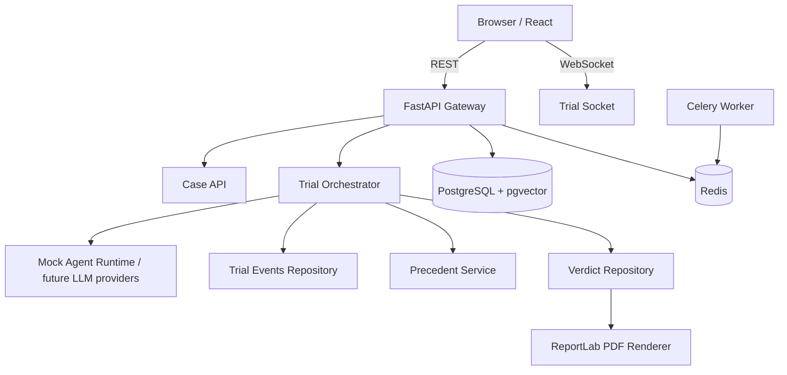

# AI Court

[](https://github.com/guilhermemichael/AI-Court/actions/workflows/ci.yml)
[](./LICENSE)
[](https://www.python.org/)
[](https://react.dev/)

> Plataforma full-stack para julgamento ficticio de conflitos domesticos com agentes de IA cooperativos, timeline processual em tempo real, memoria institucional, leis da casa, persistencia em PostgreSQL/pgvector e emissao de sentencas em PDF oficializado.

## Visao geral

AI Court transforma tretas banais em rituais tecnicamente convincentes. O usuario protocola um caso, acompanha a sessao pelo tribunal em tempo real e recebe uma sentenca PDF exageradamente oficial. O projeto foi desenhado como portifolio de engenharia de software, nao como apenas mais um chat com IA.

### Proposta tecnica

- Orquestracao multiagente com papeis separados: Escrivao, Promotor, Defesa, Perito, Juri Popular e Juiz.
- Fluxo deliberativo auditavel, com `trial_events` sequenciais para replay e observabilidade.
- Persistencia relacional com PostgreSQL e vetor semantico preparado com `pgvector`.
- Interface React com tema de tribunal cerimonial, atualizada via WebSocket.
- Geração documental com ReportLab, QR code, marca d'agua e secoes juridicas.

## Demo do produto

### Fluxo de uso

1. O usuario protocola o caso com autor, reu, argumentos e nivel de drama.
2. O backend cria o processo e inicia a recuperacao de leis da casa e precedentes.
3. Os agentes falam em ordem formal e cada evento e transmitido por WebSocket.
4. O Juiz IA consolida a deliberacao, salva o veredito e cria precedente institucional.
5. O frontend libera o download do PDF oficial da sentenca.

### Experiencia

- Abertura do caso pelo Escrivao IA.
- Acusacao formal do Promotor.
- Defesa com atenuantes emocionais.
- Pericia com indice de culpa e gravidade.
- Juri popular simulando opinioes humanas absurdamente especificas.
- Sentenca final com tom cerimonial.

## Arquitetura



### Camadas do backend

- `api/`: contratos HTTP e WebSocket.
- `application/`: orquestracao de casos de uso e fluxo do julgamento.
- `domain/`: entidades, politicas e value objects.
- `infrastructure/`: banco, runtime de agentes, PDF, fila e integracoes futuras.

Regra de projeto: a logica de sentenca, indice de culpa e ordem do julgamento ficam fora da camada HTTP.

## Estrutura do repositorio

```txt
AI-Court/
├── backend/
│   ├── app/
│   │   ├── api/
│   │   ├── application/
│   │   ├── domain/
│   │   └── infrastructure/
│   ├── alembic/
│   ├── tests/
│   └── pyproject.toml
├── frontend/
│   ├── src/
│   │   ├── app/
│   │   ├── components/
│   │   ├── features/
│   │   └── lib/
├── .github/workflows/
├── docker-compose.yml
├── Makefile
└── README.md
```

## Stack

| Camada | Tecnologia |
| --- | --- |
| Backend | Python 3.12, FastAPI, Pydantic v2 |
| Persistencia | SQLAlchemy 2, Alembic, PostgreSQL 16 |
| Busca semantica | pgvector |
| Tempo real | WebSocket nativo do FastAPI |
| Filas | Redis + Celery |
| PDF | ReportLab |
| Frontend | React 19, TypeScript, Vite |
| Motion/UI | Framer Motion, CSS customizado |
| Qualidade | pytest, Ruff, mypy, GitHub Actions |
| Infra local | Docker Compose, Makefile |

## Banco de dados

### Tabelas principais

- `cases`: processo principal com partes, argumentos, nivel de drama, estado e flag de jurisprudencia.
- `trial_events`: trilha auditavel do julgamento com `sequence_index`.
- `verdicts`: sentenca consolidada.
- `precedents`: memoria institucional preparada para embeddings.
- `house_laws`: normas domesticas ficticias usadas como base argumentativa.

### Extensoes

```sql
CREATE EXTENSION IF NOT EXISTS vector;
CREATE EXTENSION IF NOT EXISTS pgcrypto;
```

## API principal

### Criar caso

```http
POST /api/v1/cases
Content-Type: application/json

{
  "title": "O Ultimo Pedaco de Lasanha",
  "plaintiff_name": "Parte Ofendida",
  "defendant_name": "Reu da Geladeira",
  "plaintiff_argument": "Eu guardei a lasanha para o almoco do dia seguinte e ela desapareceu.",
  "defendant_argument": "Havia fome extraordinaria e boa-fe culinaria.",
  "conflict_type": "conflito alimentar",
  "drama_level": 8,
  "allow_precedents": true
}
```

### Iniciar julgamento

```http
POST /api/v1/trials/{case_id}/start
```

### Conectar ao julgamento em tempo real

```txt
WS /api/v1/ws/trials/{case_id}
```

### Baixar PDF

```http
GET /api/v1/pdfs/{case_id}
```

## Setup local

### Requisitos

- Docker Desktop
- GNU Make opcional
- Node.js 22+ opcional para frontend local sem containers
- Python 3.12+ opcional para backend local sem containers

### Subir o ambiente

```bash
cp backend/.env.example backend/.env
docker compose up --build
```

Em outro terminal:

```bash
docker compose exec backend alembic upgrade head
```

### Endpoints locais

```txt
Frontend: http://localhost:5173
Backend:  http://localhost:8000
Docs:     http://localhost:8000/docs
Health:   http://localhost:8000/health
```

## Comandos uteis

```bash
make setup
make up
make migrate
make test
make lint
make typecheck
make frontend-typecheck
make clean
```

## Variaveis de ambiente

| Variavel | Descricao |
| --- | --- |
| `DATABASE_URL` | conexao async com PostgreSQL |
| `REDIS_URL` | broker/result backend do Celery |
| `FRONTEND_ORIGIN` | origem liberada por CORS |
| `PDF_STORAGE_PATH` | diretorio de saida dos PDFs |
| `LLM_MODE` | `mock` ou `live` |
| `TRIAL_STEP_DELAY_MS` | atraso visual entre etapas do julgamento |

## Qualidade e governanca

### CI

O pipeline em `.github/workflows/ci.yml` executa:

- lint do backend com Ruff;
- typecheck do backend com mypy;
- testes unitarios com pytest;
- typecheck do frontend;
- build de producao do frontend.

### Convencao de commits

```txt
feat: add trial websocket broadcast
fix: prevent duplicate verdict creation
docs: rewrite README for portfolio positioning
refactor: isolate sentencing policy from API layer
test: add agent runtime coverage
```

## Seguranca

- O input do usuario e tratado como evidencia nao confiavel.
- UUID impede enumeracao simples de casos.
- O PDF contem disclaimer explicito de que nao possui validade juridica real.
- `allow_precedents` permite desligar memoria institucional por caso.
- O projeto esta preparado para evoluir com rate limiting, auth JWT e guardrails de prompt injection.

## Roadmap

- Auth JWT para areas privadas e historico por usuario.
- Provedores reais de LLM com prompts por agente.
- Embeddings reais e busca semantica por similaridade.
- Sistema de recursos com Ministro Revisor IA.
- Dashboard de jurisprudencia e analytics por conflito.
- Observabilidade com OpenTelemetry e metrics export.
- Deploy com reverse proxy e ambientes `dev`, `staging` e `prod`.

## Contribuindo

1. Abra uma branch baseada em `dev` ou `main`, conforme sua estrategia de fluxo.
2. Mantenha commits semanticos e pequenos.
3. Rode `make lint`, `make typecheck`, `make test` e `npm run build` no frontend antes de abrir PR.
4. Documente mudancas relevantes de arquitetura e atualize o README se o fluxo do produto mudar.

## Licenca

Distribuido sob a licenca MIT. Veja [LICENSE](./LICENSE).

## Disclaimer

AI Court e uma simulacao humoristica. Nenhuma sentenca, parecer ou PDF gerado por este sistema possui validade juridica real.
